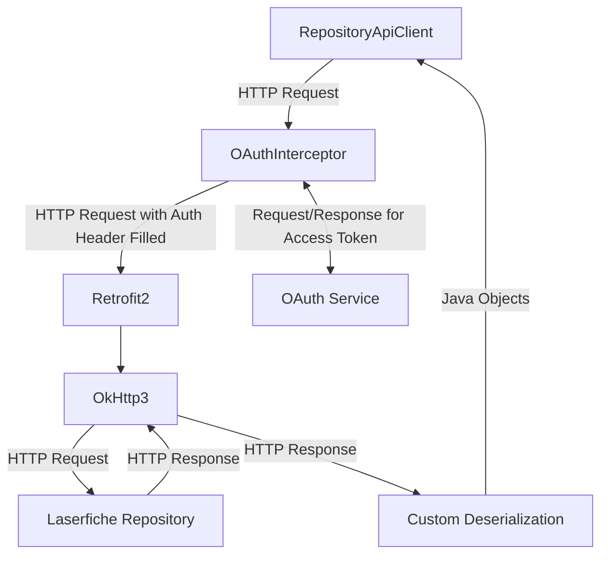
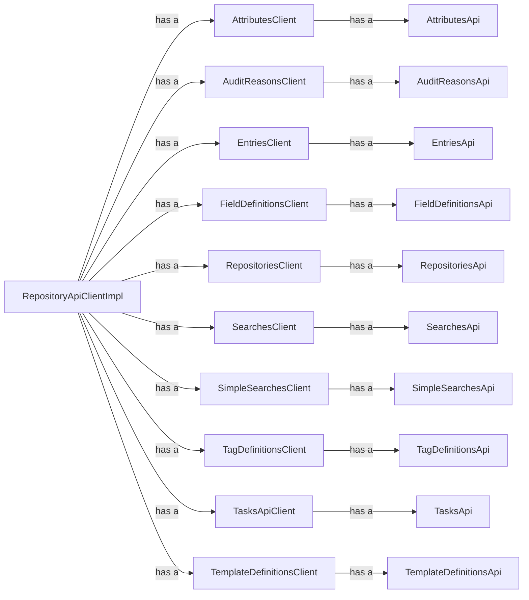

## How It Works

|Entity|Details|Interface|Class|
|-|-|-|-|
|RepositoryApiClient|This is the public interface the developer uses to get data from and set value to the Laserfiche
Repository|RepositoryApiClient|RepositoryApiClientImpl|
|OAuthInterceptor|It uses [lf-api-client-core-java](https://github.com/Laserfiche/lf-api-client-core-java) to get access
token from the OAuth service, and converts the token into a Bearer header for each outgoing HTTP
request.|okhttp3.interceptor|OAuthInterceptor|
|[Retrofit2](https://square.github.io/retrofit/)/[OkHttp3](https://square.github.io/okhttp/)|We use Swagger Codegen to
generate Retrofit methods to communicate with the Laserfiche Repository. We also have hand written Retrofit methods to
implement nextLink related APIs.|Anything under com.laserfiche.repository.api.clients.impl|Retrofit only has interface.|
|OAuth Service|Laserfiche OAuth
service|See [lf-api-client-core-java](https://github.com/Laserfiche/lf-api-client-core-java)|N/A|
|Custom Deserialization|Ideally we would rely on the auto generated code but it fails to handle anyOf, oneOf, allOf so
we have our own code for it.|Anything under com.laserfiche.repository.api.serialization|No interface|

## How Auto Generated Code Fits

Ideally we would have the entire project generated. However, the following reasons means we only keep a small portion of
auto-generated code (Retrofit interfaces and model classes).

1. We have our own OAuth implementation. Take a look at the generated project you will find the second largest portion
   of code are for authorization/authentication (with the first being model classes). Our OAuth implementation exposes a
   similar API to `okHttp3.interceptor` so it's a natural fit for `okHttp3.interceptor` while incompatible with the
   generated OAuth implementations. The second largest portion of code is then removed.

2. The current inability for Swagger Codegen (and many other) OpenAPI code generators to properly
   handle [oneOf, allOf, anyOf](https://swagger.io/docs/specification/data-models/oneof-anyof-allof-not/) means that we
   need our own deserialization code to determine which class the JSON object should be serialized into. So we get rid
   of some of the serialization code.

In the end, the only auto generated code left is the Retrofit interfaces and model classes.

**What this means when you contribute code:** when the `swagger.json` updates, one generates a new project using Swagger
Codegen then

1. Take only the updated methods in Retrofit interfaces, paste them into the existing interfaces.
2. If the method in 1 has corresponding nextLink and forEach APIs, add/update the corresponding `paginate` method in the
   Retrofit interface.
3. Update the correspoding [wrapper classes](#client-wrapper-classes).

## Client Wrapper Classes

`RepositoryApiClient` is the only public interface the user needs to care about. From which, they could access per REST
route client (such as `AttributesClient` and `EntriesClient`). These per route client is a wrapper over the Retrofit
interfaces. It decouples the Retrofit implementation to our APIs. We could potentially swap out the Retrofit part with
some other HTTP clients. But there's more. The wrapper classes also provides forEach and nextLink implementation to
certain APIs.

